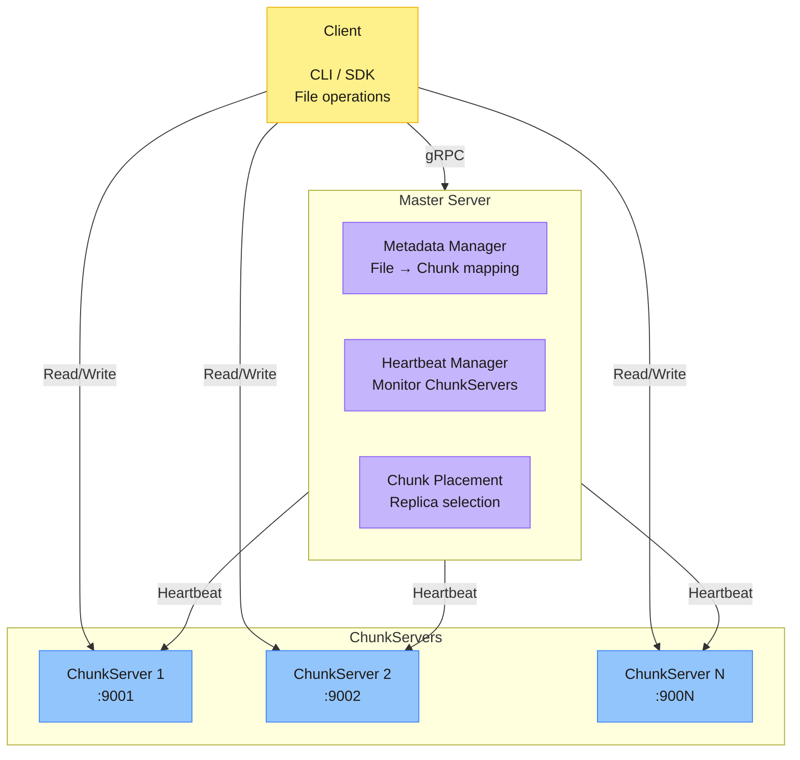
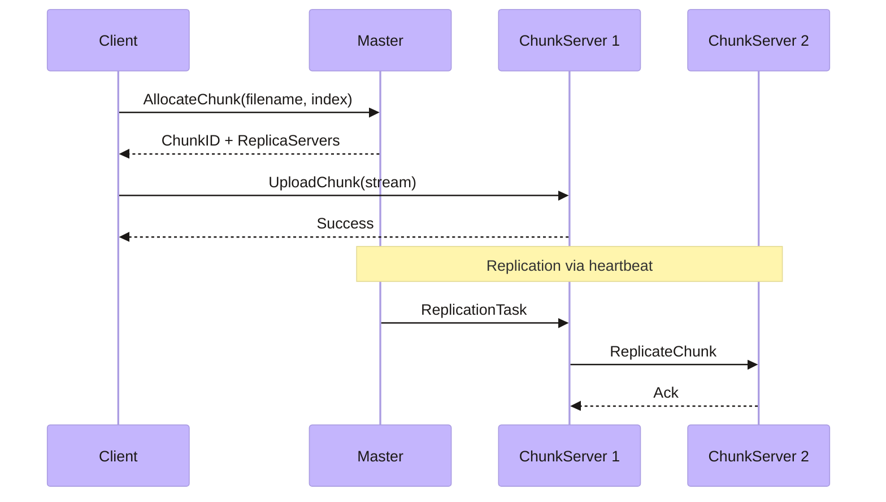
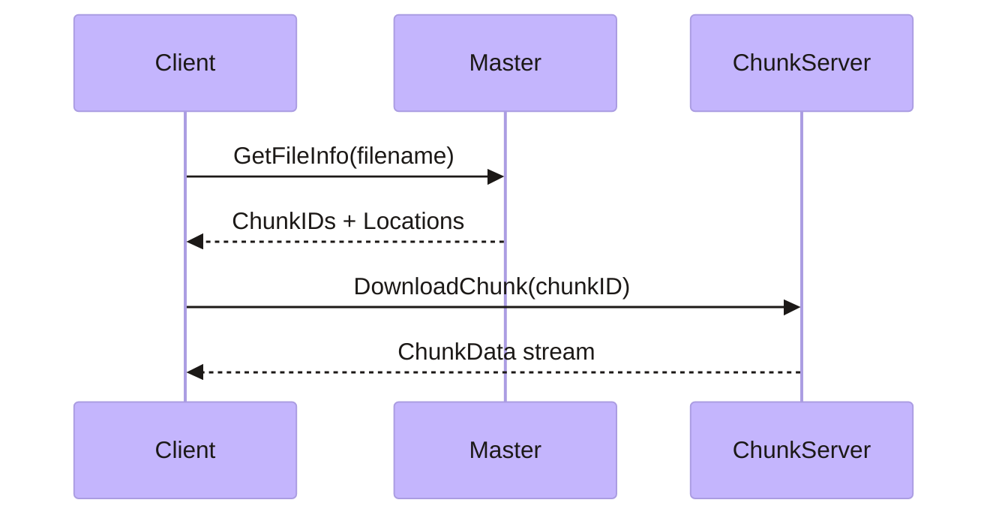

# Distributed File System (DFS)

A simplified Distributed File System inspired by GFS and HDFS. Features a master node for metadata management and multiple chunk servers for distributed data storage with automatic replication.

## Quick Start

```bash
# Build all binaries
go build -o bin/dfs-master ./cmd/master
go build -o bin/dfs-chunkserver ./cmd/chunkserver
go build -o bin/dfs-client ./cmd/client

# Start the master server
./bin/dfs-master

# Start chunk servers (in separate terminals)
./bin/dfs-chunkserver -port :9001 -master localhost:8000 -dir ./data/cs1
./bin/dfs-chunkserver -port :9002 -master localhost:8000 -dir ./data/cs2

# Upload a file
./bin/dfs-client put /path/to/local/file.txt remote-name.txt

# Download a file
./bin/dfs-client get remote-name.txt /path/to/download/dir
```

---

## Features

### ✅ Implemented

| Feature | Description |
|---------|-------------|
| File Upload | Chunked upload with automatic allocation |
| File Download | Reassembly from distributed chunks |
| Chunk Replication | Configurable replication factor (default: 2) |
| Heartbeat System | Bidirectional streaming for health monitoring |
| Dead Server Detection | Automatic detection and replication triggering |
| Replica Placement | Storage-aware server selection |
| Structured Logging | slog-based logging with levels |
| Client SDK | High-level API for file operations |
| CLI Tool | Command-line interface for put/get operations |

### 🔜 Planned

- Write pipeline (chain replication)
- Lease management for primary writes
- Checksum verification
- Graceful shutdown handling

---

## Architecture

```
┌─────────────────────────────────────────────────────────────────┐
│                           Client                                 │
│  ┌─────────────────────────────────────────────────────────┐    │
│  │  DFSClient SDK                                           │    │
│  │  ┌───────────┐  ┌────────────┐  ┌────────────────────┐  │    │
│  │  │ Uploader  │  │ Downloader │  │ MasterClient       │  │    │
│  │  └───────────┘  └────────────┘  └────────────────────┘  │    │
│  └─────────────────────────────────────────────────────────┘    │
└─────────────────────────────────────────────────────────────────┘
                              │
                              │ gRPC
                              ▼
┌─────────────────────────────────────────────────────────────────┐
│                        Master Server                             │
│  ┌─────────────┐  ┌──────────────┐  ┌────────────────────────┐  │
│  │ Metadata    │  │ Heartbeat    │  │ Chunk Placement        │  │
│  │ Manager     │  │ Manager      │  │ Manager                │  │
│  └─────────────┘  └──────────────┘  └────────────────────────┘  │
└─────────────────────────────────────────────────────────────────┘
                              │
                              │ gRPC (Heartbeat + Tasks)
                              ▼
┌─────────────────────────────────────────────────────────────────┐
│                       Chunk Servers                              │
│  ┌───────────────┐  ┌───────────────┐  ┌───────────────┐        │
│  │ ChunkServer 1 │  │ ChunkServer 2 │  │ ChunkServer N │        │
│  │ :9001         │  │ :9002         │  │ :900N         │        │
│  └───────────────┘  └───────────────┘  └───────────────┘        │
└─────────────────────────────────────────────────────────────────┘
```

### Component Diagram



### Write Sequence



### Read Sequence



---

## Project Structure

```
dfs/
├── cmd/                    # Entry points
│   ├── master/main.go      # Master server binary
│   ├── chunkserver/main.go # Chunk server binary
│   └── client/main.go      # CLI client binary
│
├── internal/               # Private implementation
│   ├── master/             # Master server logic
│   ├── chunkserver/        # Chunk server logic
│   └── client/             # Client SDK
│       ├── dfsclient.go    # High-level SDK
│       ├── uploader/       # Upload handling
│       ├── downloader/     # Download handling
│       └── masterclient/   # Master communication
│
├── pkg/                    # Shared packages
│   └── logger/             # Structured logging
│
├── dfs/                    # Generated protobuf code
│   ├── masterpb/
│   └── chunkpb/
│
└── proto/                  # Protobuf definitions
```

---

## CLI Usage

```bash
# Upload a file
./bin/dfs-client put <local-file> <remote-name>

# Download a file
./bin/dfs-client get <remote-name> <local-directory>

# Specify custom master address
./bin/dfs-client -master localhost:9000 put file.txt myfile.txt
```

### Chunk Server Flags

```bash
./bin/dfs-chunkserver [flags]

Flags:
  -port string    Chunk server address (default ":9001")
  -master string  Master server address (default ":8000")
  -dir string     Storage directory (default "./data")
```

---

## Configuration

| Parameter | Default | Description |
|-----------|---------|-------------|
| `REPLICATION_FACTOR` | 2 | Number of replicas per chunk |
| `CHUNK_SIZE` | 64 MB | Size of each chunk |
| `LIVE_THRESHOLD` | 30s | Server considered dead after this |
| Heartbeat Interval | 5s | Chunk server heartbeat frequency |

---

## Data Flow

### Write Path

1. Client requests chunk allocation from Master
2. Master returns ChunkID and replica servers
3. Client uploads directly to chunk server
4. Master triggers replication via heartbeat

### Read Path

1. Client requests file info from Master
2. Master returns chunk locations
3. Client downloads chunks directly from chunk servers
4. Client reassembles file from chunks

---

## Heartbeat System

Chunk servers maintain a bidirectional gRPC stream with the master:

**ChunkServer → Master:**
- Server address
- Free storage (MB)
- List of stored chunks

**Master → ChunkServer:**
- Replication tasks
- Delete tasks

---

## Development

```bash
# Build all
go build ./...

# Run tests
go test ./...

# Lint
go vet ./...
```

---

## License

MIT
