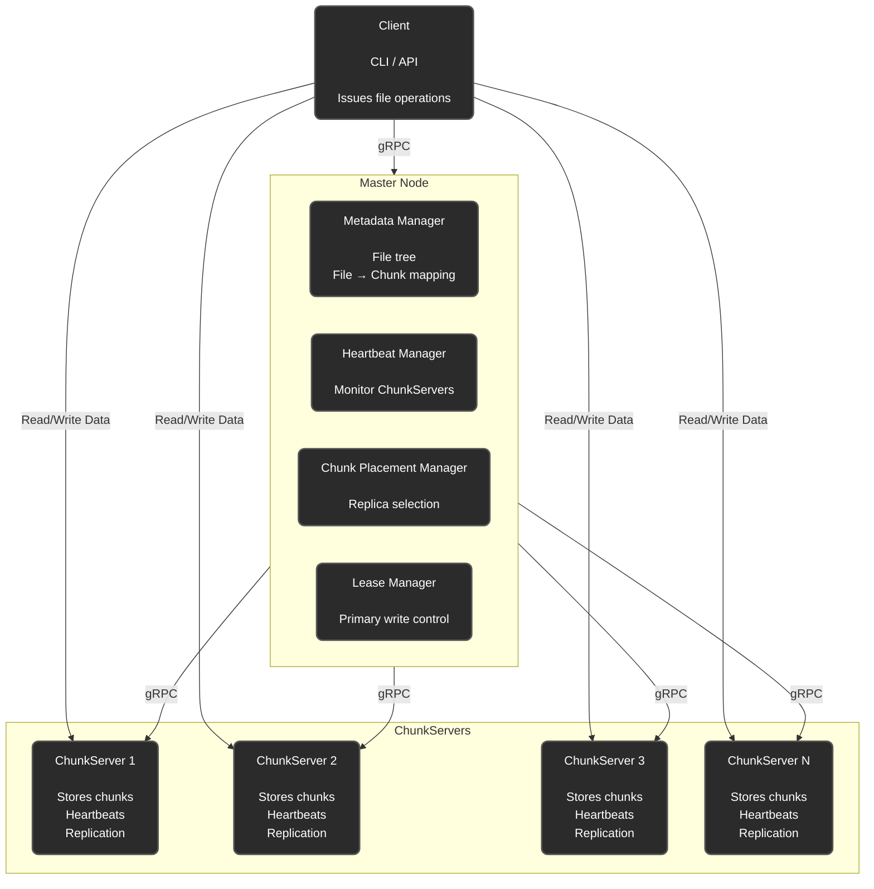
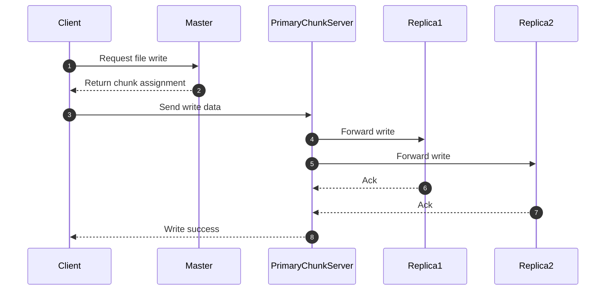
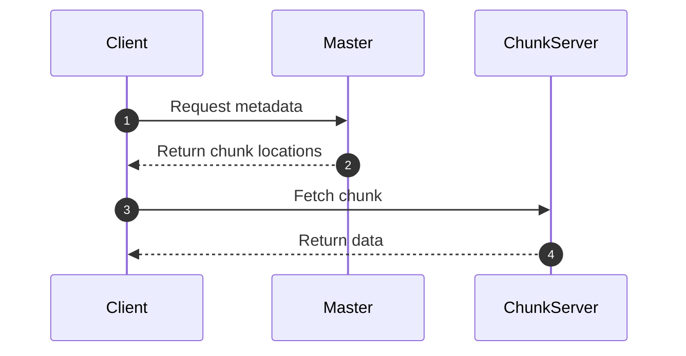
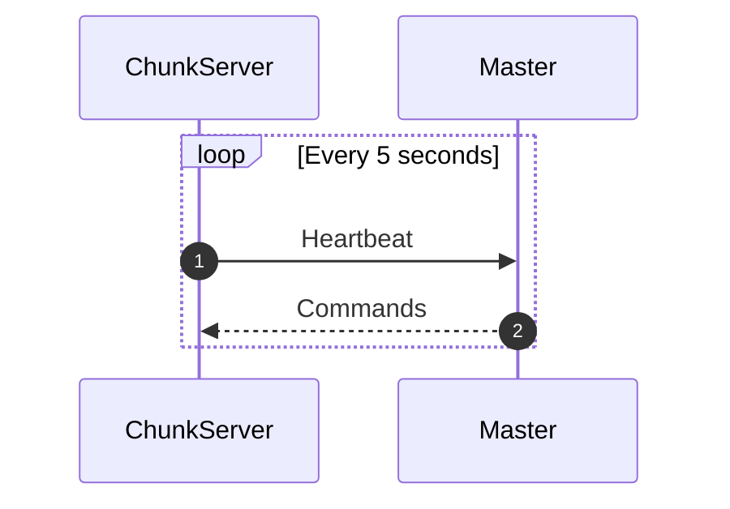
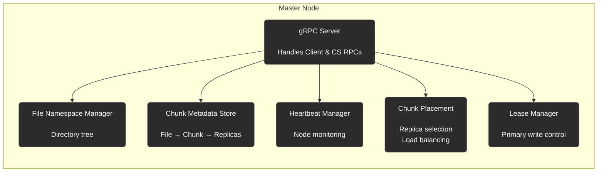

# Distributed File System

This project is a simplified Distributed File System inspired by the architecture of systems like GFS and HDFS. It is designed to demonstrate how a distributed storage layer can be structured, including a master node that manages metadata and multiple chunk servers that store data.

The goal is to build a fully functional DFS that supports file uploads, downloads, metadata management, chunk replication, heartbeats, and write pipelines.

---

## Table of Contents

* [Overview](#overview)
* [Features](#features)
* [Architecture](#architecture)
* [Component Diagram](#component-diagram)
* [Write Sequence](#write-sequence)
* [Read Sequence](#read-sequence)
* [ChunkServer Heartbeats](#chunkserver-heartbeats)
* [Master Node Internal Architecture](#master-node-internal-architecture)

---

## Overview

The system consists of:

* A Client
* A Master Node
* Multiple ChunkServers

Data flow:

1. Client asks the master for metadata or chunk placement.
2. Master returns assigned chunkservers.
3. Client uploads/downloads data directly from chunkservers.

---

## Features

### Implemented

* File upload
* File download
* Basic master–client communication
* Metadata management
* Heartbeats
* Replica placement

### To Be Implemented

* Chunking
* Write pipeline (primary + replicas)
* Lease management
* Master internal subsystems ( code isn't clean rn , will focus on it after getting the basic proto up )

---

## Architecture

The system follows a master–worker model. The master stores metadata, while chunkservers store data. The client interacts with both.

---

## Component Diagram

---

## Write Sequence

---

## Read Sequence

---

## ChunkServer Heartbeats

---

## Master Node Internal Architecture

---

This document will evolve as implementation progresses.
